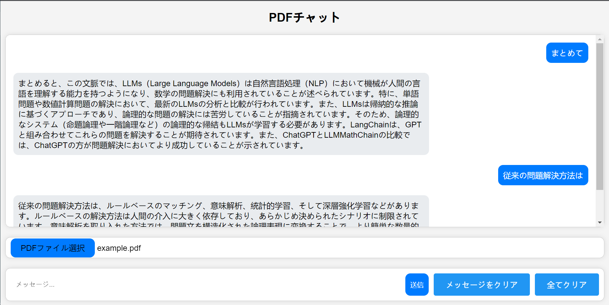

# PDFチャット

これは、あるPDFファイルを巡るチャットロボット。これはlangchainの簡単な活用事例の一つだが、langchainを元にしてより複雑なアプリケーションを開発できる。

## 環境

Typescript==5.2.2

Python==3.9.13

* openai==0.28.1
* langchain==0.0.314
* Flask==3.0.0
* gevent==23.9.1


## 使用手順

`config.ini`で自分のAPI_KEYを入力し、モデルを選択。

```bash
python app.py
```

Chromeなでブラウザで`http://localhost:5000/`を開く。


## 特徴


* APIでGPT-4にアクセスする際は、料金が使用量に応じて発生。
* ２つのクリアボタンに波紋効果を実装。
* フロントエンドとバックエンドを分離
* ...

## 効果


